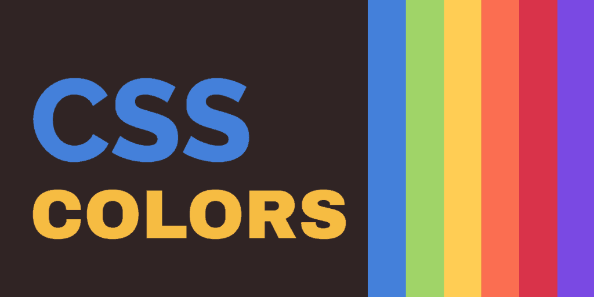

# The Colors in CSS :

**Pixle** : is a smallest unit of a digital image that can be displayed on any digital display device(tiny squares).
**AND** The monitors of the Computers are made of thousnds of these pixles.

## Color :
It is a property is used to set the color of the text :
**
 Hello World! 
**
To fill this blank above with the value of the color, you have three choices: 
* RGB Values : stands for Red-Green-Blue (defines the intensity of the color as an integer between 0 and 255). 
> To get a red color => (255,0,0).

> To get a green color => (0,255,0).

> To get a Yellow you mix the Red with the Green like this => (255,255,0)

* HEX Codes : They also defines the intensity of the Red-Green-Blue but using six digits preceded by a hash # (Hexadicmal code)
> #CD5C5C	,  #F08080	AND so on.

* Color Names : Where you can use the name of the wanted color as a value.
* HSL : (HUE-SATURATION-Lightness)

>Hue => is near to the colloquial idea of color.

>Saturation => Saturation refers to the amount of gray in a color.

>Lightness => is the amount of white (lightness) or black (darkness) in a color.

* HSB : (HUE-SATURATION-BRIGHTNESS)
it is the same like HSL but instead of lightness there is Brightness which refers to how much black is in a color.

 

## background-color : 
CSS treats each HTML element as if it appears in a box so this propert set the background color of that box. To change the background of the whole page we put this property inside the body element.

> **Contrast** : When we chose a foreground or background we must consider that if these colors are suitable to the text color to make it legible.

|low Contrast| high Contrast|medium Contrast|
|------------|--------------|---------------|
|It is harder to read the text in this situation.|It is easy to read the text.| It improves the readability.|

