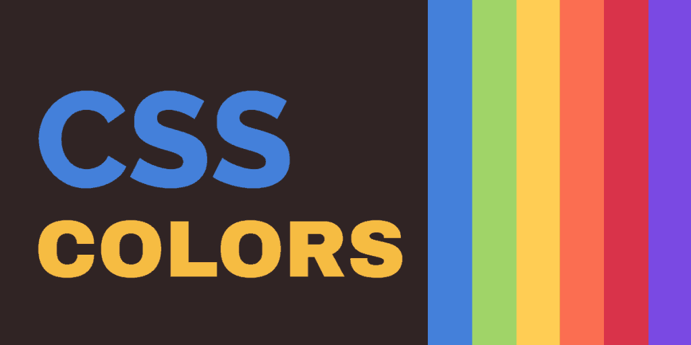

# Contents 

## 1) HTML

>> CHAPTER 5: 
>> * How to add images to pages
>> * Choosing the right format
>> * Optimizing images for the web


## 2) CSS

>> CHAPTER 11: 
>> * How to specify colors
>> * Color terminology and contrast
>> * Background color

>> CHAPTER 12:
>> * Size and typeface of text
>> * Bold, italics, capitals, underlines
>> * Spacing between lines, words, and letters

<br>
<br>
<hr>
<br>
<br>
<br>


## 1) HTML
>> CHAPTER 5: 


**How to add an image to your website?** 

```

```

**How to specify the size of your image?**

>> Height & Width with a pixels values

**Where to place the images?**

* Before a paragraph

* Inside the start of a paragraph

* In the middle of a paragraph

**Types of images :**

**1-** JPEG : We use it for the images about natural scenes and photographs.

**2-** PNG : Images that have texts and objects. Also, for logos.

**3-** GIF : Animation images.

<br>


**Compression**

>> Compressing the images, videos, texts, etc is really a mjor thing to do in order to make them easy loaded. So, There are two types of compression :

>> * Lossles : There is no data loss when you compress the image so when you re-compress the image will be the same as before.

>> * Lossy : Unlike the previous, there is a data loss.

**1-** JPEG : Lossy.

**2-** PNG : Lossles.

**3-** GIF : Lossles.


**Transparency**

**1-** JPEG : Don't support transparency .

**2-** PNG : Support transparency.

**3-** GIF : Support transparency.


<br>
<br>
<hr>
<br>
<br>
<br>


## 2) CSS
>> CHAPTER 11:



**Pixle** : is a smallest unit of a digital image that can be displayed on any digital display device(tiny squares).
**AND** The monitors of the Computers are made of thousnds of these pixles.


+ **Color :**

It is a property is used to set the color of the text :
**<p style="color:_____"> Hello World! </p>**
To fill this blank above with the value of the color, you have three choices: 
* RGB Values : stands for Red-Green-Blue (defines the intensity of the color as an integer between 0 and 255). 
> To get a red color => (255,0,0).

> To get a green color => (0,255,0).

> To get a Yellow you mix the Red with the Green like this => (255,255,0)

* HEX Codes : They also defines the intensity of the Red-Green-Blue but using six digits preceded by a hash # (Hexadicmal code)
> #CD5C5C	,  #F08080	AND so on.

* Color Names : Where you can use the name of the wanted color as a value.
* HSL : (HUE-SATURATION-Lightness)

>Hue => is near to the colloquial idea of color.

>Saturation => Saturation refers to the amount of gray in a color.

>Lightness => is the amount of white (lightness) or black (darkness) in a color.

* HSB : (HUE-SATURATION-BRIGHTNESS)
it is the same like HSL but instead of lightness there is Brightness which refers to how much black is in a color.


<br>

+ **background-color :**

CSS treats each HTML element as if it appears in a box so this property set the background color of that box. To change the background of the whole page we put this property inside the body element.

> **Contrast** : When we chose a foreground or background we must consider that if these colors are suitable to the text color to make it legible.

|low Contrast| high Contrast|medium Contrast|
|------------|--------------|---------------|
|It is harder to read the text in this situation.|It is easy to read the text.| It improves the readability.|


<br>


+ **Color picker :**

There are many tools can help the developer to choose the right colors for the website.


>> <cite> CSS3 has introduced an extra value for RGB colors to indicate opacity (transparency). It is known as RGBA. </cite> <mark> [1]</mark>


<hr>
<br>
<br>

## 2) CSS
>> CHAPTER 12

+ **Typeface Terminology :**

**1-** Serif : Backing to the dictionary it say "A slight projection finishing off a stroke of a letter in certain typefaces", They were easy to read when be used for long passages of texts.

**2-** Sans-Serif : The opposite of the serif, They have straight ends to the letters. If text is small it can be clearly read using this type.

**3-** Monospace : All the letters will be shown with the same width (usually used for codes).

<hr>
<br>

**1-** Weight: This Shows how much the text is bold.

**2-** Style: It can be (normal, italic, and oblique) 
>> Italic fonts have a cursive aspect to some of the lettering.

>> Oblique fonts are the same as normal but they put in into an angle.

**3-** 
| condensed                              | expanded                          |
| -------------------------------------- | --------------------------------- |
| letters are thinner and closer together| they are thicker and further apart|

**4-** Units of type sire : 

* Pixels : The best way to set the fone size, Are relative to the resolutin of the screen
* Percentages
* Ems : It allows changing the size of text relative to the size of the text in the parent element 

**But what If I want to use a specific type of font that is not common?**
>> You easily can do that by using **@font-face**, It allows you to download the type of font for the machines that they don't have. But you need to provide the path of that font.


**Here is a cheat sheet for some properties:**

| Property           | Its effect                                                                                             |
| ------------------ | ------------------------------------------------------------------------------------------------------ |
| ``font-family``    | Specifies the name of the chosen font                                                                  |
| ``src``            | To provide the path of the font when we use @font-face technique                                       |
| ``font-weight``    | It allows you to make your text bold as much as you want. There are two common values (Normal, bold)   | 
| ``font-style``     | To change the style of the text (Normal, Italic,oblique)                                                 |
| ``text-transform`` | To change the case of the text for one od these values (Uppercase, lowercase, capitlize)                 |
| ``text-decoration``| To decorate your text as following: (None, underline, throughline, blink)                                |
| ``line-height``    | Measured from the bottom of the descender on one line to the top of the ascender on the next             |
| ``letter-spacing`` | Make spaces between the letters and we use em for that                                                   |
| ``word-spacing``   | To determine the space between those letters                                                             |
| ``text-align``     | (Right, left, center, justifiy --> all lines take the same width of the containing box except the last)  |
| ``vertical-align`` | It uses with tables and inline lements (baseline, sub, super, top, text-top, middle, bottom, text-bottom)|
| ``text-indent``    | I want the h1 for the search engin but I don't want to use it, so this allows you to push it away        |
| ``text-shadow``    | It gives the text a shadow and you to specify a color and orientations                                   |
| ``:first-letter``  | (pseudo-elements) --> To specify different value for the first letter                                    |
| ``:first-line``    | (pseudo-elements) --> To specify different value for the first line                                      |
| ``:link``          | This allows you to set styles for links that have not yet been visited                                   |
| ``:visited``       | This allows you to set styles for links that have been visited                                           |
| ``:hover``         | When you point your cursor over an element it will change its appearance                                 |
| ``:active``        | To show that this button or link has been clicked on, when an elementis being activated by a user        |
| ``:focus``         |  to use the tab key on your keyboard to move through the interactive items on a page                     |


<br>
<br>
<hr>
<br>
<br>


* <mark>[1]</mark> HTML and CSS by Jon Duckett. 
