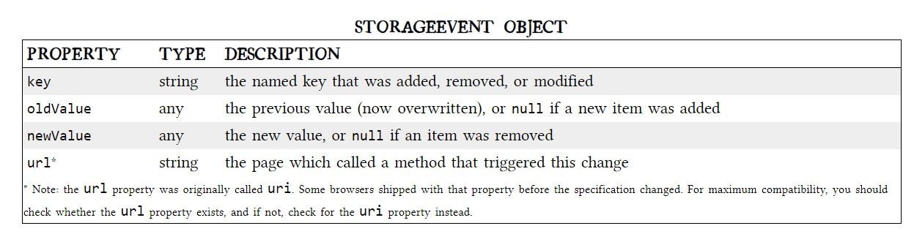

# LOCAL STORAGE FOR WEB APPLICATIONS

<br>
<br>


>> An HTTP cookie (web cookie, browser cookie) is a small piece of data that a server sends to the user's web browser. <mark> [1] </mark> But they have three potentially dealbreaking downsides:

* Slowing down your web application by needlessly transmitting the same data over and over.

* Sending data unencrypted over the internet.

* Cookies are limited to about 4 KB of data.


<br>
<br>


**what is HTML5 Storage?**

>>It is a way for web pages to store named key/value pairs locally.

**What is the difference between HTML5 Storage and cookies?**


| HTML5 Storage                                                   | Cookies                                                         |
| --------------------------------------------------------------- | --------------------------------------------------------------- |
| They are both allowing data persists even if you navigate away from the web browser or close the tab or even close the web browser|
| this data is never transmitted to the remote web server         | The opposite happens here                                       |

<br>
<br>

### OKAY! Now, How can we access the HTML5 Storage?


>> We use localStorage for that, But what is exactly the local Storage?

>>> It is an object stores data(allow to save key/value pairs in a web browser) with no expiration date. The data will not be deleted when the browser is closed, and will be available the next day, week, or year. <mark> [2] </mark>

<br>
<br>

### USING HTML5 STORAGE

>> HTML5 Storage is based on named key/value pairs. You store data based on a named key, then you can retrieve that data with the same key.  <mark> [3] </mark>

>> By default the datatype of stored will be string but you can cast it later to whatever datatype you want. for example: you can use ``ParseInt()`` + ``ParseFloat()``

<br>
<br>

**Now, the syntax of usine the localStorage:**


<br>

```
window.localStorage // Allows you to access a Storage object for the Document's origin

//Now, for its methods:

localStorage.setItem("key", "value"); // To set the keys and their values

localStorage.getItem("key"); // To get the key (select it)

localStorage.removeItem("key"); // To remove the key

localStorage.clear(); // To clear all the stored data in the localStorage object

```
<br>
<br>

```

var foo = localStorage["bar"];
// ...
localStorage["bar"] = foo;

```

<br>


* The storage event occurs when there is a change in the window's change area.

* The storage event is only triggered when a window other than itself makes the changes.

```
//syntax

window.addEventListener("storage", myScript);

```

<br>
<br>




<br>
<br>
<hr>
<br>
<br>

* [<mark>[1]</mark> developer.mozilla](https://developer.mozilla.org/en-US/docs/Web/HTTP/Cookies)

* [<mark>[2]</mark> W3School](https://www.w3schools.com/jsref/prop_win_localstorage.asp)

* [<mark>[3]</mark> diveinto](http://diveinto.html5doctor.com/storage.html)